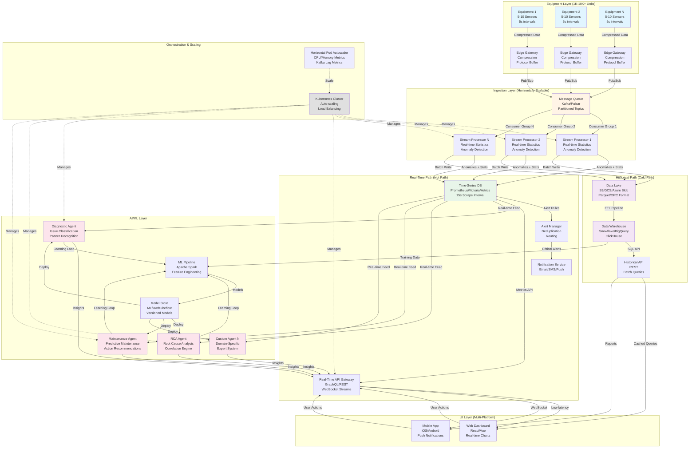

# Real-Time Anomaly Detection System - Architecture

## System Overview

This document outlines the architecture for a scalable real-time anomaly detection system capable of monitoring 1,000-10,000+ pieces of industrial equipment with sub-30-second anomaly detection and alerting.

## High-Level Architecture Diagram



## Data Flow Paths

### 1. Real-Time Anomaly Detection Path (Hot Path)
**Latency Target: < 30 seconds**

```
Equipment Sensors (5s intervals)
  → Edge Gateway (compression)
  → Kafka/Pulsar (partitioned by equipment_id)
  → Stream Processors (parallel processing)
      ├─ Calculate statistics (avg, stddev, min, max)
      ├─ Detect anomalies (z-score, threshold, ML model)
      └─ Flag critical events
  → Time-Series DB (Prometheus/VictoriaMetrics)
  → Alert Manager (rule evaluation)
  → Notification Service (SMS/Email/Push)
  → Real-Time Dashboard (WebSocket updates)
```

**Key Characteristics:**
- In-memory processing
- Stateful stream aggregation (windowing)
- Sub-second write latency to TSDB
- Push-based alerting
- WebSocket for real-time UI updates

### 2. Historical Analysis Path (Cold Path)
**Latency Target: Minutes to hours**

```
Equipment Sensors (5s intervals)
  → Edge Gateway (compression)
  → Kafka/Pulsar
  → Stream Processors
  → Batch Writers (5-minute batches)
  → Data Lake (S3/GCS - Parquet format)
      └─ Partitioned by date/equipment_id
  → ETL Pipeline (daily/hourly)
  → Data Warehouse (columnar storage)
  → Historical API (cached queries)
  → Dashboard (trend analysis, reports)
```

**Key Characteristics:**
- Batch-optimized writes (compression, columnar)
- Cost-optimized storage (object storage)
- SQL-based analytics
- Time-series partitioning
- Query result caching

### 3. AI/ML Agent Path
**Update Frequency: Real-time inference, periodic training**

```
Training Path:
  Data Warehouse
    → ML Pipeline (Spark)
    → Feature Engineering
    → Model Training
    → Model Store (versioned)
    → Deploy to Agents

Inference Path:
  Time-Series DB (real-time metrics)
    → Diagnostic Agent (issue classification)
    → RCA Agent (correlation analysis)
    → Maintenance Agent (predictive models)
    → Insights & Recommendations
    → Real-Time API
    → Dashboard/Mobile
```

**Agent Fleet:**

1. **Diagnostic Agent**
   - Classifies equipment issues
   - Pattern recognition across sensor types
   - Severity scoring

2. **Root Cause Analysis (RCA) Agent**
   - Correlates multi-sensor failures
   - Analyzes temporal patterns
   - Identifies causal relationships

3. **Maintenance Agent**
   - Predicts component failures
   - Recommends preventive actions
   - Optimizes maintenance schedules

4. **Custom Domain Agents**
   - Industry-specific logic
   - Compliance checking
   - Cost optimization

## Technology Stack

### Ingestion Layer
- **Message Queue**: Apache Kafka / Apache Pulsar
  - Partitioned by equipment_id for parallelism
  - 7-day retention for replay
  - Consumer groups for horizontal scaling

- **Stream Processors**:
  - Flink / Kafka Streams / Python (asyncio)
  - Stateful windowing (5-second tumbling windows)
  - Exactly-once semantics

### Real-Time Storage
- **Time-Series DB**: Prometheus / VictoriaMetrics / TimescaleDB
  - 15-second scrape interval
  - 30-day retention
  - PromQL for querying

- **Alert Manager**: Prometheus AlertManager
  - Rule-based alerting
  - Deduplication and grouping
  - Multi-channel routing

### Historical Storage
- **Data Lake**: AWS S3 / Google Cloud Storage
  - Parquet format (10x compression)
  - Partitioned by date and equipment_id
  - Lifecycle policies (hot → warm → cold)

- **Data Warehouse**: Snowflake / BigQuery / ClickHouse
  - Columnar storage
  - Materialized views for common queries
  - Time-series optimized

### AI/ML Infrastructure
- **ML Pipeline**: Apache Spark / Ray
  - Distributed feature engineering
  - Model training (scikit-learn, TensorFlow, PyTorch)
  - Hyperparameter tuning

- **Model Store**: MLflow / Kubeflow
  - Version control for models
  - A/B testing support
  - Model registry

- **Serving**: TensorFlow Serving / TorchServe
  - Real-time inference (<100ms)
  - Batch prediction
  - Auto-scaling

### UI Layer
- **Web**: React / Vue.js
  - Real-time charts (D3.js, Plotly)
  - WebSocket connections
  - Responsive design

- **Mobile**: React Native / Flutter
  - Push notifications
  - Offline support
  - Location-based routing

### Orchestration
- **Container Orchestration**: Kubernetes
  - Horizontal Pod Autoscaler (HPA)
  - Cluster Autoscaler
  - Rolling deployments

- **Service Mesh**: Istio / Linkerd
  - Traffic management
  - Observability
  - Security (mTLS)

## Scaling Strategy

### Current Scale (1,000 Equipment Units)
- **Data Volume**: ~50K-100K data points/sec (5-10 sensors × 1,000 units ÷ 5 sec)
- **Kafka Partitions**: 20 partitions (50 units/partition)
- **Stream Processors**: 5 instances (200 units/instance)
- **TSDB**: Single-node Prometheus or small VictoriaMetrics cluster
- **Storage**: ~1 TB/month compressed

### Target Scale (10,000 Equipment Units)
- **Data Volume**: ~500K-1M data points/sec
- **Kafka Partitions**: 100 partitions (100 units/partition)
- **Stream Processors**: 20-50 instances (auto-scaled)
- **TSDB**: VictoriaMetrics cluster (3+ nodes)
- **Storage**: ~10 TB/month compressed

### Horizontal Scaling Mechanisms

1. **Ingestion Layer**
   - Add Kafka partitions (rebalance)
   - Scale consumer groups automatically
   - Use partition keys for even distribution

2. **Processing Layer**
   - Kubernetes HPA based on:
     - CPU/Memory utilization
     - Kafka consumer lag
     - Message queue depth
   - Stateless processors for easy scaling

3. **Storage Layer**
   - TSDB: Add read replicas and shards
   - Data Lake: Infinite object storage
   - Data Warehouse: Add compute clusters

4. **AI/ML Layer**
   - Model serving: Auto-scale based on request rate
   - Training: Distributed Spark clusters
   - Agent instances: Scale per equipment groups

## Performance Characteristics

### Real-Time Path
- **Ingestion Latency**: <1 second (sensor → Kafka)
- **Processing Latency**: <5 seconds (Kafka → TSDB)
- **Alert Latency**: <10 seconds (anomaly detection → notification)
- **UI Update Latency**: <15 seconds (end-to-end)
- **Total SLA**: <30 seconds (anomaly → customer alert)

### Historical Path
- **Batch Write Frequency**: Every 5 minutes
- **Data Lake Write Latency**: <10 minutes
- **ETL Pipeline**: Hourly/Daily
- **Query Response Time**: <5 seconds (with caching)

### AI/ML Path
- **Inference Latency**: <100ms per prediction
- **Model Update Frequency**: Weekly/Monthly
- **Training Duration**: Hours (depends on data volume)

## Fault Tolerance & Reliability

### Redundancy
- Multi-AZ deployment for all critical services
- Kafka replication factor: 3
- Database replication: Primary + 2 replicas
- Load balancers with health checks

### Error Handling
- **Edge Gateway**: Local buffering (1-hour capacity)
- **Kafka**: Persistent queue, retryable errors
- **Stream Processors**: Dead letter queues
- **Alerts**: Retry with exponential backoff

### Monitoring
- Infrastructure metrics (CPU, memory, disk)
- Application metrics (latency, throughput, errors)
- Business metrics (anomaly rate, alert rate)
- Distributed tracing (OpenTelemetry)

## Security

- **Data in Transit**: TLS 1.3 encryption
- **Data at Rest**: AES-256 encryption
- **Authentication**: OAuth 2.0 / SAML
- **Authorization**: RBAC for equipment groups
- **Network**: VPC isolation, security groups
- **Secrets**: Vault / AWS Secrets Manager

## Cost Optimization

1. **Tiered Storage**
   - Hot (15 days): TSDB (expensive, fast)
   - Warm (90 days): Data Warehouse (medium)
   - Cold (>90 days): Data Lake (cheap, slow)

2. **Compression**
   - Edge compression: Protocol Buffers (5x)
   - Data Lake: Parquet (10x)
   - Time-series: Gorilla compression (20x)

3. **Auto-Scaling**
   - Scale down during low-traffic periods
   - Right-size instances based on metrics
   - Use spot/preemptible instances for batch workloads

4. **Query Optimization**
   - Materialized views for common queries
   - Result caching (Redis)
   - Time-based partitioning

## Future Enhancements

1. **Edge AI**: Deploy lightweight models on edge gateways
2. **Federated Learning**: Train models without centralizing data
3. **Multi-Region**: Global deployment for latency reduction
4. **Advanced Analytics**: Graph analytics for equipment relationships
5. **Digital Twins**: Virtual equipment replicas for simulation
6. **Prescriptive Analytics**: Automated remediation actions

## Conclusion

This architecture provides:
- ✅ Real-time anomaly detection (<30 seconds)
- ✅ Scalability (1K → 10K+ equipment units)
- ✅ Dual paths (real-time + historical)
- ✅ Multi-platform UI (web + mobile)
- ✅ AI-powered diagnostics and recommendations
- ✅ Horizontal scaling at every layer
- ✅ Fault tolerance and reliability
- ✅ Cost-optimized storage and compute
